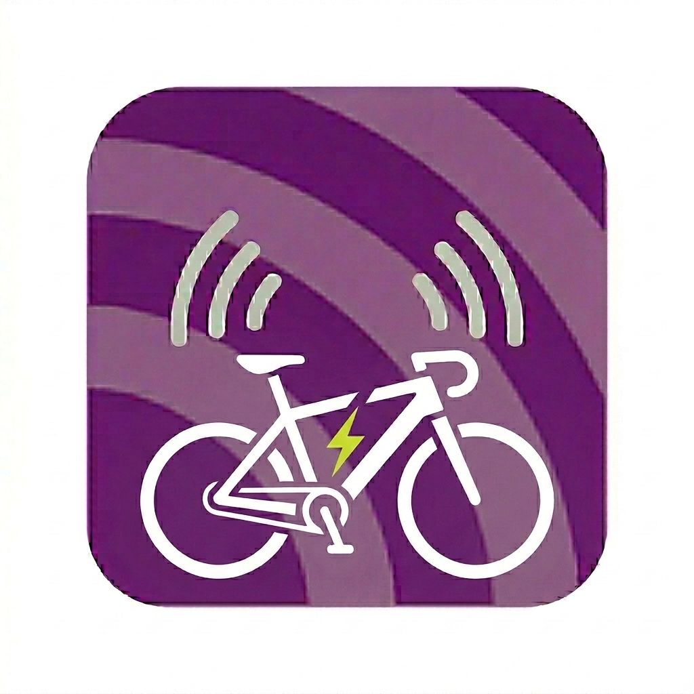
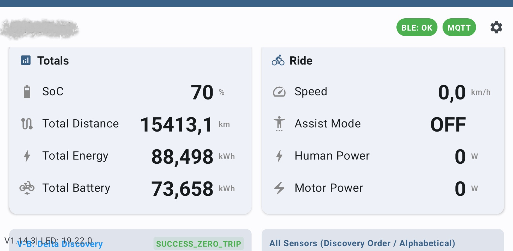
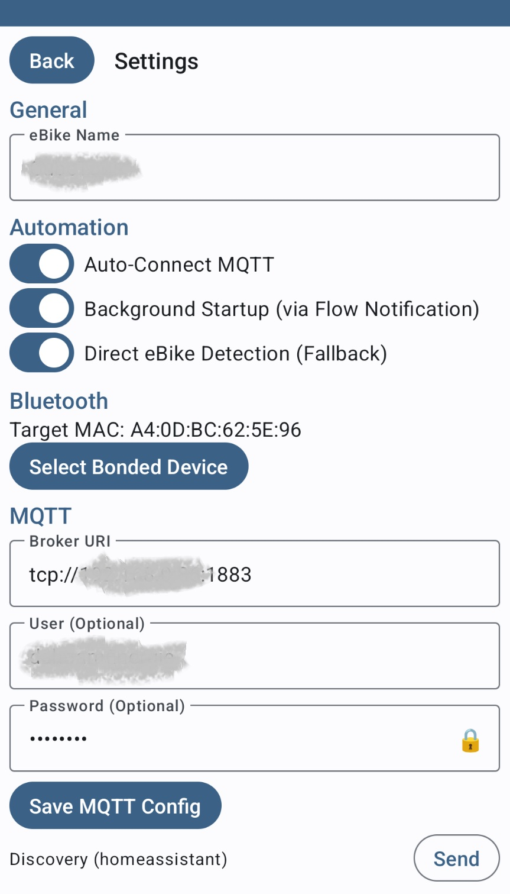
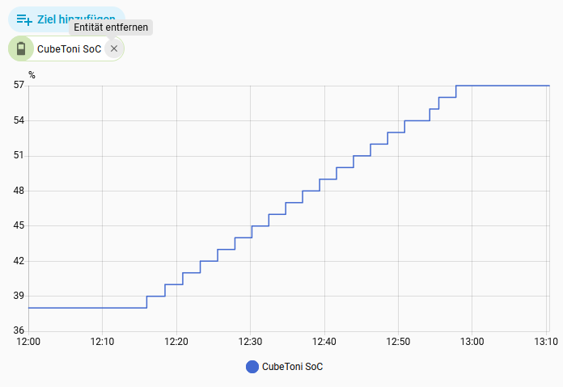
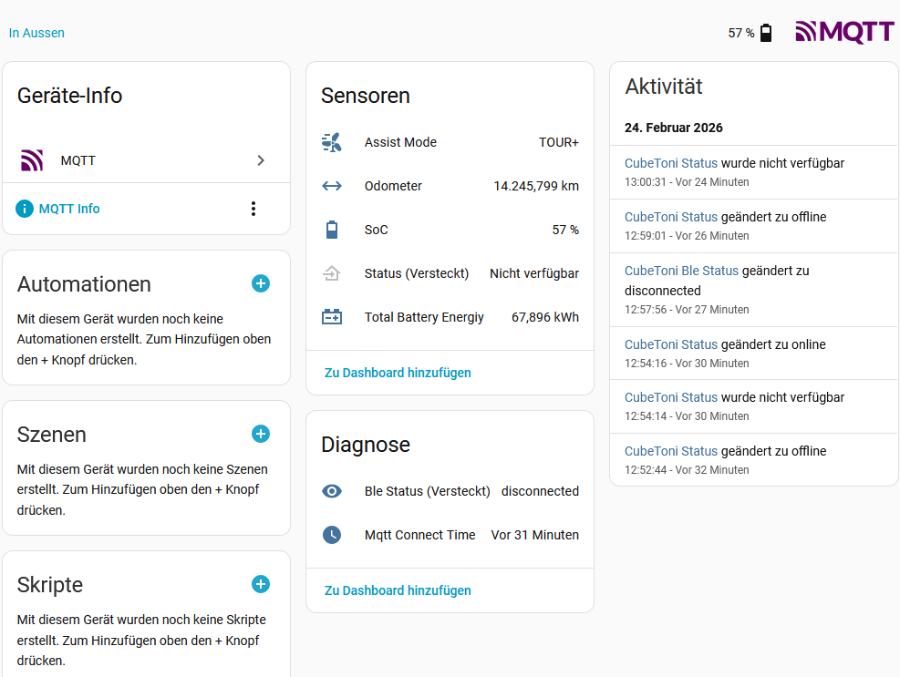

# Bosch smart system ebike (BES3) live data monitoring to MQTT

## eBikeMonitor

 

## Description
This Android app gets data from your Bosch eBike by listeneing to the Bluetooth traffic and pushes values via MQTT to a broker. It acts as a bridge between your Bosch Gen4 Smart System Ebike and your smart home system (e.g. Home Assistant).

## How this works
The eBikeMonitor listens to the BLE traffic between the eBike and the official Bosch Flow app.
Running eBikeMonitor on a different Android device than the one with the Bosch Flow app will not work!

## Getting Started / How to Use

### 1. Initial Setup

1. **Pairing**: Ensure your eBike is paired (bonded) with your Android device via system Bluetooth settings.
2. **Permissions**: The app requires **Usage Access** permission to detect if the Bosch Flow app is running. The dashboard will warn you and prompt you to grant this if it is missing. Also, ensure Bluetooth is powered on.
3. **Settings Configuration**:
   - Open the **Settings** screen (gear icon).
   - Give this eBike a name in **eBike Name** field. This will be the MQTT device name in home asisstant
   - **Select eBike**: Choose your paired eBike from the Bluetooth devices list.
   - **MQTT Setup**: Enter your MQTT broker URI (e.g., `tcp://192.168.1.10:1883`), username, and password.
   - **Preferences**: Toggle auto-connect for BLE and MQTT, and auto-launch for the Flow app as desired.
4. For first time usage the Flow app should not be connected to eBike before eBikeMonitor connects via BLE. (This will gather the correct assist mode names from the eBike for the early beginning)

### 2. Daily Usage Sequence
To ensure reliable data collection, follow this precise sequence:

1. **Turn on your eBike.**
2. **Launch the eBikeMonitor app.**
3. If auto-connect is enabled in settings, eBikeMonitor will automatically connect to the eBike (BLE) and start the MQTT connection. The corresponding action buttons will turn green.
4. If auto-launch is enabled, eBikeMonitor will automatically start the Bosch Flow app once the BLE connection is established. Otherwise, tap the **FLOW** action button to start it.
5. **Keep the Flow app open** until real-time data appears on the eBikeMonitor dashboard. Typically duration is 2 seconds.
6. **Automatic MQTT Reconnection**: You can launch the app and start your ride even if you are away from home. If auto-connect is enabled, the app will automatically establish the MQTT connection as soon as your phone reaches your home network (or wherever your broker is located) and will immediately send the latest received sensor data.

### 3. Monitoring UI & Features
- **Action Buttons**: The top row shows the status of MQTT, BLE, and the FLOW app. Green means connected/running, red/gray means disconnected/stopped. You can tap these to manually toggle connections or launch/stop the Flow app.
- **Charging**: To monitor the charging process, run the startup sequence above, and afterwards connect the charger to the bike. The battery must be charged while mounted in the eBike. The smartphone must maintain a BLE connection to the eBike during the entire charging process.
Charging curve example:
- **Versions**: The lower left corner of the UI shows the eBikeMonitor version and the LED remote SW version of the smart system eBike.

## Home Assistant Integration

The eBikeMonitor app supports **MQTT Discovery** for Home Assistant, meaning you do not need to manually configure sensors.

1. Ensure the MQTT connection is active (the MQTT button on the dashboard is green).
2. Go to the **Settings** screen.
3. Tap the **"Send Discovery to Home Assistant"** button.
4. Your eBike will automatically appear as a new Device in Home Assistant, with all its sensors (Speed, Battery, Assist Mode, Power, etc.) ready to use.

## initial BLE decoding info
BLE decoding info is based on: https://github.com/RobbyPee/Bosch-Smart-System-Ebike-Garmin-Android

## License
This project is licensed under the GNU GPL v3.0 - see the [LICENSE] file for details.
