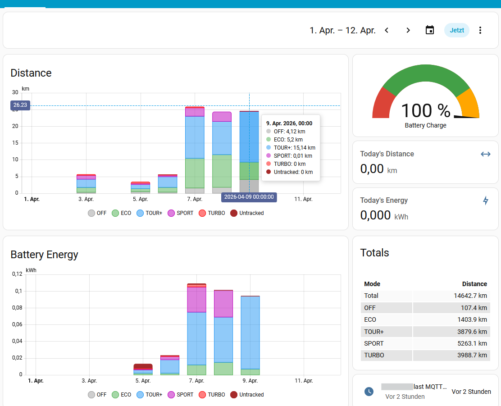
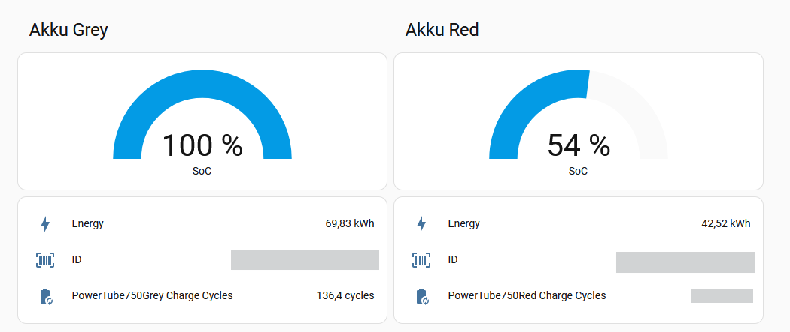
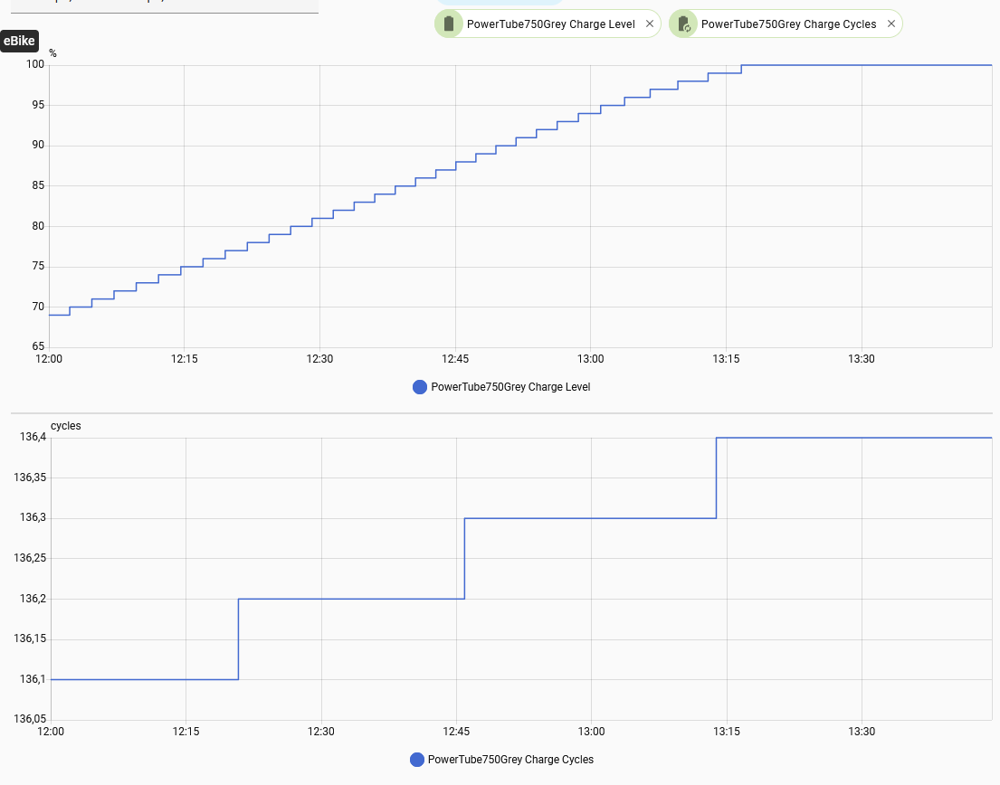
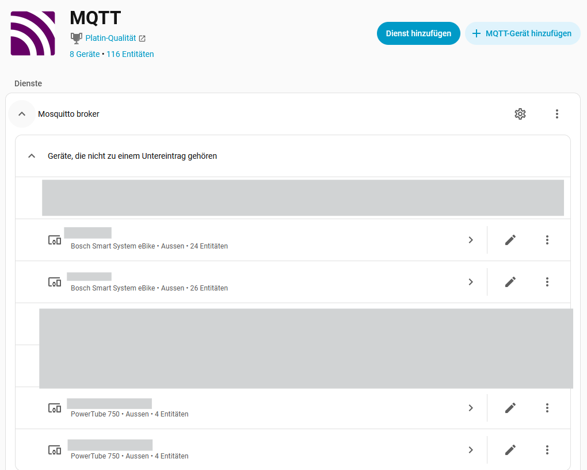

# Bosch smart system ebike (BES3) live data monitoring to MQTT

## eBikeMonitor

 

## Description
This Android app collects data from your Bosch eBike by listening to the Bluetooth traffic between the LED remote and the Flow app, then pushes the values to an MQTT broker. It acts as a bridge between your Bosch Gen4 Smart System eBike and your smart home system (e.g., Home Assistant).

The app separates data for different bikes and batteries. If you use multiple eBikes or battery packs, the app will automatically detect and display the data for the currently connected hardware.

The app features a simple dashboard to display current sensor values.

## How this works
The eBikeMonitor listens to the BLE traffic between the eBike and the official Bosch Flow app. Since this requires a bonded BLE connection, eBikeMonitor must be installed on the same Android device as the Bosch Flow app.

For decoding see [BLE TOPICS](BLE_TOPICS.md).

## Getting Started / How to Use

### 1. Initial Setup

1. **Pairing**: Ensure your eBike is paired (bonded) with your Android device via the system Bluetooth settings.
2. **Permissions**: The app requires **Usage Access** permission to detect if the Bosch Flow app is running. The dashboard will display a warning and prompt you to grant this if it is missing. Also, ensure Bluetooth is enabled.
3. **Settings Configuration**:
   - Open the **Settings** screen (gear icon).
   - **eBike Name**: Enter a name for your eBike. This name will be used for the MQTT device in Home Assistant.
   - **Select eBike**: Choose your paired eBike from the Bluetooth devices list so the app knows which hardware to track.
   - **MQTT Setup**: Enter your MQTT broker URI (e.g., `tcp://192.168.1.10:1883`), username, and password.
   - **Automation**: Configure "Auto-Connect MQTT", "Background Startup", "Direct eBike Detection (Fallback)", "Hardware Connection Trigger (Fast Startup)", and **"Home Sync Window"** to manage how the app runs automatically in the background.

### Privacy & Permissions Note
To detect if the Bosch Flow app is running, this app requires the **Usage Access** (`PACKAGE_USAGE_STATS`) permission. Additionally, it uses the **Query All Packages** (`QUERY_ALL_PACKAGES`) permission to locate the Flow app on your device. For background automation, the app requires **Notification Access** to read when the Flow app connects to your eBike. It also utilizes the Android **Companion Device Manager** to directly detect your eBike's Bluetooth hardware presence. These permissions are used exclusively for local state detection and automation (auto-launching/stopping). No personal browsing data or package lists are transmitted or collected.

### 2. First Ride

As soon as BLE connects to the eBike, the latest active data is updated on the screen.
Assist mode-specific distance and energy data require internal decoding. You may need to ride for a short distance in each mode before valid data can be transmitted via MQTT.

### 3. Daily Usage Sequence
With background automation enabled, the sequence is completely hands-off:

1. **Turn on your eBike.**
2. That's it! 
   - If **Hardware Connection Trigger** is enabled, eBikeMonitor will wake up instantly by listening to your phone's low-level Bluetooth connection events, starting even faster than the Flow app notification.
   - If **Background Startup** is enabled, eBikeMonitor will wake up automatically as soon as the Bosch Flow app connects. *(**CRITICAL:** You must enable "Ride Screen / Pocket Mode" notifications inside the official Bosch Flow app settings for this to work!)*
   - If **Direct eBike Detection** is enabled, the Android system will wake eBikeMonitor directly when it senses the eBike's Bluetooth hardware.
3. The app will silently connect to BLE and MQTT in the background to sync your ride data. You will see a small, persistent notification indicating that background monitoring is active.

**Manual Mode:**
If you prefer not to use background automation:
1. Turn on your eBike.
2. Launch the eBikeMonitor app. It will automatically connect (if auto-connect is enabled) and pull in data.
**Automatic MQTT Reconnection & Home Sync Window**: 
You can start your ride even if you are away from home. Once your eBike turns off, the app continues trying to reach the MQTT broker for a configurable **Home Sync Window** (default: 2 minutes). When your phone reconnects to your home network, the app automatically transmits your latest ride data — so nothing is ever lost, even if you rode away from home WiFi.

### 4. Monitoring UI & Features
- **Status Dashboard**: The top row displays an active status indicator showing whether the background monitoring is actively connected to your eBike or waiting for a connection. It also includes an **MQTT** diagnostic button (Green = Connected, Red = Disconnected) that you can tap to manually restart the MQTT connection if needed.
- **Charging**: To monitor charging, follow the startup sequence above, then connect the charger to the bike. The battery must be charged while mounted in the eBike, and the smartphone must maintain a BLE connection to the eBike throughout the process.
- **Debug Info**: Swiping up (scrolling down) on the main dashboard reveals detailed diagnostic and debugging information, including raw sensor payloads, BLE characteristics, and assist mode discovery metrics. A persistent debug log file is written to the device storage — see [LOG REFERENCE](LOG_REFERENCE.md) for a full description of all log entries and states.
- **Versions**: The lower-left corner of the UI displays the eBikeMonitor version and the LED remote software version.

Charging curve example:

## Home Assistant Integration

The eBikeMonitor app supports **MQTT Discovery** for Home Assistant, meaning you do not need to manually configure sensors.

1. Ensure the MQTT connection is active (the MQTT button on the dashboard is green).
2. Go to the **Settings** screen.
3. Tap the **"Send Discovery to Home Assistant"** button.
4. Your eBike will automatically appear as a new Device in Home Assistant, with all its sensors (Speed, Battery, Assist Mode, Power, etc.) ready to use.
5. The mounted battery will be automatically discovered and shown as a new device in Home Assistant. You can rename these devices or update their Entity IDs to match your preferred naming convention.

For detailed MQTT topics see [MQTT TOPICS](MQTT_TOPICS.md).

## Initial BLE Decoding Information
BLE decoding info is based on: https://github.com/RobbyPee/Bosch-Smart-System-Ebike-Garmin-Android

## License
This project is licensed under the GNU GPL v3.0 - see the [LICENSE] file for details.
